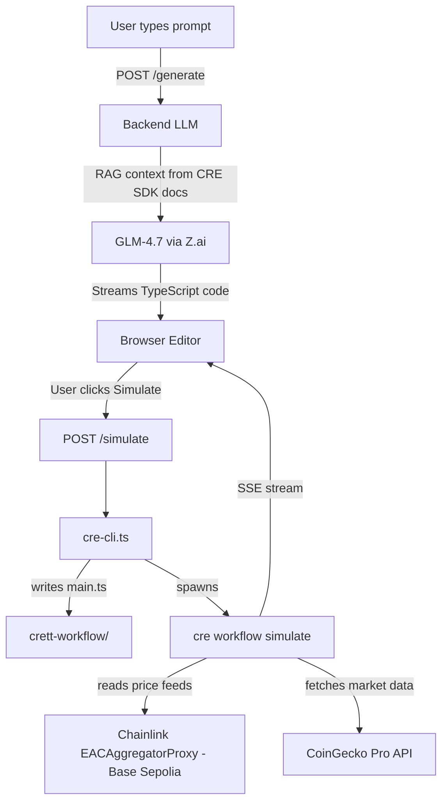
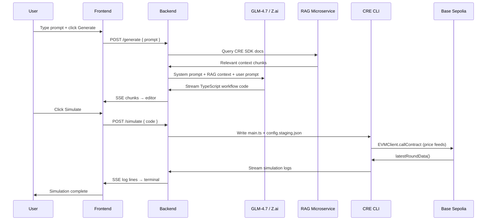

# Crett — AI-Powered CRE Workflow Studio

> Chainlink Convergence 2026 Hackathon submission.

Crett is a browser-based IDE that lets you **describe a CRE workflow in plain English**, generate valid [`@chainlink/cre-sdk`](https://www.npmjs.com/package/@chainlink/cre-sdk) TypeScript code with AI, simulate it via the CRE CLI, and deploy it to the Chainlink Runtime Environment.

**Demo video:** _[link]_

---

## Table of Contents

- [What This Demo Does](#what-this-demo-does)
- [Repository Structure](#repository-structure)
- [How It Works](#how-it-works)
- [Prerequisites](#prerequisites)
- [Quick Start](#quick-start)
  - [Option 1: Simulate a workflow directly (fastest)](#option-1-simulate-a-workflow-directly-fastest)
  - [Option 2: Run the full Crett IDE](#option-2-run-the-full-crett-ide)
- [Chainlink Files Index](#chainlink-files-index)
- [CRE Workflow — Chainlink Integration](#cre-workflow--chainlink-integration)
- [Smart Contracts](#smart-contracts)

---

## What This Demo Does

1. **Describe** — Type a prompt like _"alert me when ETH/USD drops below $2 000"_
2. **Generate** — A GLM-4.7 LLM (augmented with a RAG index of CRE SDK docs) generates a valid `@chainlink/cre-sdk` TypeScript workflow file
3. **Simulate** — The backend writes the code to `crett/crett-workflow/main.ts` and executes `cre workflow simulate` — output streams live to the editor terminal
4. **Debug** — If simulation fails, AI diagnoses the exact CRE error and proposes a fix
5. **Deploy** — One-click deploy to the CRE network (requires CRE Early Access)

Generated workflows read **Chainlink Price Feeds on Base Sepolia** via `EVMClient.callContract()` and fetch market data from **CoinGecko Pro** via `HTTPClient` — satisfying the CRE requirement of integrating a blockchain with an external data source.

---

## Repository Structure

```
.
├── fe/                     # Next.js 16 IDE frontend (port 3000)
├── backend/                # Express.js API + CRE CLI wrapper (port 3001)
├── rag/                    # RAG microservice — Supabase vector index of CRE SDK docs (port 3002)
├── crett/
│   └── crett-workflow/     # CRE workflow project (main.ts overwritten on each simulate)
├── contract/               # Foundry contracts (Base Sepolia)
└── README.md
```

### Frontend (`fe/`)
Next.js app with Monaco editor, file explorer, AI generate panel, market data preview, and live terminal output.

**Key files:**
- `fe/app/dashboard/page.tsx` — main IDE shell (generate, simulate, deploy orchestration)
- `fe/lib/starter-templates.ts` — built-in CRE workflow examples

### Backend (`backend/`)
Express server that orchestrates LLM generation and CRE CLI execution.

**Key files:**
- `backend/src/lib/llm.ts` — system prompt, CRE SDK patterns, few-shot examples, RAG injection
- `backend/src/lib/cre-cli.ts` — spawns `cre workflow simulate` / `cre workflow deploy`
- `backend/src/lib/cre-templates.ts` — three reference CRE workflow templates
- `backend/src/lib/chainlink-context.ts` — verified Base Sepolia feed addresses injected into prompt

### CRE Workflow (`crett/crett-workflow/`)
The active CRE TypeScript project. The backend overwrites `main.ts` with each newly generated workflow before running simulation.

---

## How It Works

### Architecture Overview



### Flow of Operations



---

## Prerequisites

- [Node.js](https://nodejs.org/) v20+
- [Chainlink Runtime Environment CLI](https://docs.chain.link/cre/get-started/install-cli) — installed and logged in:
  ```bash
  cre login
  ```
- **Z.ai API key** — LLM inference (GLM-4.7)
- **CoinGecko Pro API key** — market data in generated workflows
- **Supabase project** — only needed for the RAG service (optional — generation works without it)

---

## Quick Start

### Option 1: Simulate a workflow directly (fastest)

Use this to verify the CRE integration without running the full IDE.

```bash
# 1. Clone the repo
git clone <repo-url>
cd chainlink

# 2. Install CRE workflow dependencies
cd crett/crett-workflow
npm install

# 3. Set config
# Edit crett/crett-workflow/config.staging.json:
{
  "schedule": "*/30 * * * * *",
  "coinGeckoApiKey": "<YOUR_COINGECKO_PRO_KEY>"
}

# 4. Run simulation (from crett/ directory)
cd ..
cre workflow simulate ./crett-workflow \
  -T staging-settings \
  --non-interactive \
  --trigger-index 0
```

The included `crett/crett-workflow/main.ts` is a working ETH/USD price alert workflow that reads the Chainlink feed on Base Sepolia and fetches CoinGecko market data. A passing run ends with:
```
Simulation complete
```

---

### Option 2: Run the full Crett IDE

#### Step 1 — Environment variables

**`backend/.env`**
```env
ZAI_API_KEY=            # Z.ai key (powers GLM-4.7 LLM)
COINGECKO_API_KEY=      # CoinGecko Pro key
PORT=3001
# Optional:
RAG_URL=http://localhost:3002
CRE_PROJECT_ROOT=/absolute/path/to/crett
```

**`fe/.env`**
```env
NEXT_PUBLIC_BACKEND_URL=http://localhost:3001
COINGECKO_API_KEY=
NEXT_PUBLIC_WALLETCONNECT_ID=   # optional
```

**`rag/.env`** (optional — skip if you don't have Supabase)
```env
ZAI_API_KEY=
SUPABASE_URL=
SUPABASE_SERVICE_KEY=
RAG_PORT=3002
```

#### Step 2 — Start services

Open **3 terminals**:

```bash
# Terminal 1 — RAG microservice (optional, skip if no Supabase)
cd rag && npm install && npm run dev

# Terminal 2 — Backend
cd backend && npm install && npm run dev

# Terminal 3 — Frontend
cd fe && npm install && npm run dev
```

Open [http://localhost:3000/dashboard](http://localhost:3000/dashboard)

#### Step 3 — Generate and simulate

1. Click the **wand icon** (AI Generate) in the left sidebar
2. Enter a prompt, e.g. `Monitor ETH/USD on Base Sepolia — alert if price drops below $2000`
3. Click **Generate** — code streams into the editor
4. Click **Simulate** — the terminal streams live `cre workflow simulate` output
5. Passing simulation ends with `Simulation complete`

> **Note:** If the CRE CLI is not installed or `~/.cre/bin/cre` is not found, the backend falls back to a mock simulation for demo purposes.

---

## Chainlink Files Index

Files that use Chainlink products (`@chainlink/cre-sdk`, CRE CLI, price feed contracts):

| File | What it uses |
|------|-------------|
| `backend/src/lib/llm.ts` | CRE SDK import patterns, feed addresses, SDK rules injected into LLM system prompt |
| `backend/src/lib/cre-cli.ts` | Spawns `cre workflow simulate` and `cre workflow deploy` via CRE CLI |
| `backend/src/lib/cre-templates.ts` | Three reference CRE workflows used as few-shot examples |
| `backend/src/lib/chainlink-context.ts` | Verified Base Sepolia feed addresses injected into LLM context |
| `crett/crett-workflow/main.ts` | Live CRE workflow (overwritten on each simulate) |
| `crett/crett-workflow/package.json` | `@chainlink/cre-sdk ^1.0.9` dependency |
| `fe/lib/starter-templates.ts` | Built-in CRE workflow starter templates |

---

## CRE Workflow — Chainlink Integration

Generated workflows use two Chainlink-native primitives:

| Integration | SDK primitive | What it does |
|------------|--------------|-------------|
| **Chainlink Price Feeds (Base Sepolia)** | `EVMClient.callContract()` | Reads `latestRoundData()` from EACAggregatorProxy on-chain |
| **External API (CoinGecko Pro)** | `HTTPClient.sendRequest()` | Fetches real-time price + market cap data |

### Feed Addresses (Base Sepolia)

| Pair | Address |
|------|---------|
| ETH/USD | `0x4aDC67696bA383F43DD60A9e78F2C97Fbbfc7cb1` |
| LINK/USD | `0xb113F5A928BCfF189C998ab20d753a47F9dE5A61` |
| BTC/USD | `0x0FB99723Aee6f420beAD13e6bBB79b7E6F034298` |

These addresses are injected into the LLM system prompt via `backend/src/lib/chainlink-context.ts` so every generated workflow uses the correct, verified addresses automatically.

### Simulation Config

Only two fields are required in `config.staging.json` — all others use Zod `.default()` values:

```json
{
  "schedule": "*/30 * * * * *",
  "coinGeckoApiKey": "<YOUR_KEY>"
}
```

---

## Smart Contracts

Contracts live in `contract/` (Foundry project, targets Base Sepolia).

```bash
cd contract
forge script script/Deploy.s.sol \
  --rpc-url $BASE_SEPOLIA_RPC \
  --broadcast \
  --private-key $PRIVATE_KEY
```

| Contract | Purpose |
|----------|---------|
| `AlertRegistry.sol` | Implements `IReceiver` — stores on-chain price alerts written by CRE workflows |
| `RiskLog.sol` | Implements `IReceiver` — logs risk events from CRE workflows |
| `TreasuryMock.sol` | Mock USDC balance readable by `EVMClient.callContract()` in workflows |

---

## Tech Stack

| Layer | Technology |
|-------|-----------|
| Frontend | Next.js 16, Monaco Editor, TailwindCSS, wagmi/viem |
| Backend | Express.js, TypeScript, Server-Sent Events |
| AI / LLM | GLM-4.7 via Z.ai (OpenAI-compatible API) |
| RAG | Supabase pgvector — CRE SDK docs index |
| CRE | `@chainlink/cre-sdk ^1.0.9`, CRE CLI |
| Chain | Base Sepolia |

---

**Security note:** This is a hackathon demo. Do not use production private keys or real funds.
